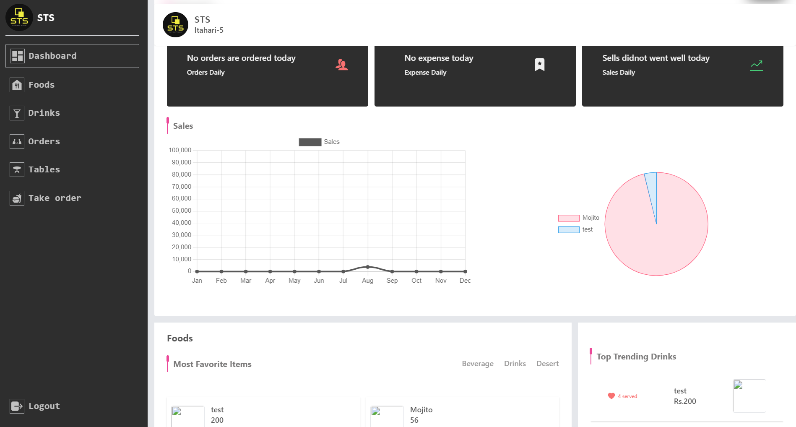

# STS-Software(Restaurant Management Desktop App)



Welcome to the Restaurant Management Desktop App! This Electron.js application is designed to help restaurant owners and managers efficiently manage orders, payments, stock (foods and drinks), menus, and staff.

## Features

- **Order Management:** Easily create, modify, and track customer orders.
- **Payment Processing:** Efficiently process payments and keep a record of transactions.
- **Stock Management:** Monitor and manage your restaurant's food and drink inventory.
- **Menu Creation:** Design and customize menus with ease.
- **Staff Management:** Keep track of your staff, their roles, and schedules.
- **Sales Reports:** Generate daily, weekly, monthly, and yearly sales reports.

## Getting Started

### Prerequisites

Before running the app, ensure you have the following prerequisites installed:

- Node.js and npm: [Download and Install Node.js](https://nodejs.org/)
- Git: [Download and Install Git](https://git-scm.com/)

### Installation

1. Clone this repository:

```bash
git clone https://github.com/NirojT/StsFrontend.git
```

2. Navigate to the project directory:

```bash
cd restaurant-app
```

3. Install project dependencies:

```bash
npm install
```

or

```bash
yarn
```

### Usage

Run
To run the app, use the following command:

```bash
 npm run dev
```

or

```bash
yarn run dev
```

This will start the development server and open the app in a new Electron window.

Build
To build the app for production, use:

```bash
npm run build-desktop
```

or

```bash
yarn run build-desktop
```

This will generate a production-ready application in the dist/ directory.

### Acknowledgments

- Electron.js
- Vite

### Contact

For questions or support, please contact STS.
<br>
Happy restaurant management!
